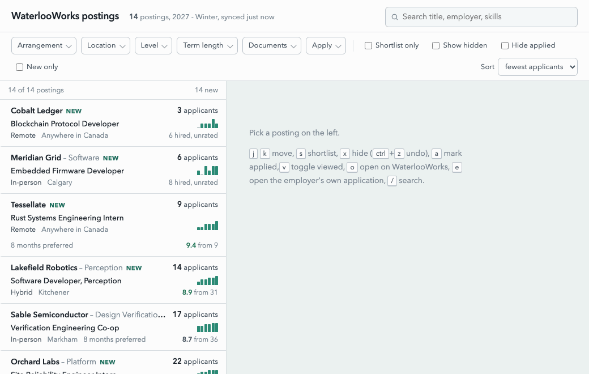

# `wwlocal`: a tolerable WaterlooWorks viewer

wwlocal is a local viewer for WaterlooWorks jobs with a tolerable UX. It scrapes job data from WaterlooWorks using your session credentials once into a local SQLite database, and then provides a local viewer over that database. Since the local viewer does not need to query WaterlooWorks (except when navigating to the submit-application page on demand), searching, filtering, and viewing details for jobs all run near-instantaneously.

(demo uses fake data)


## LLM usage statement

All code in this project was written by Fable 5.1 and the software is released into the public domain under the terms of the Unlicense. This README was written by hand without any AI assistance.

## Installation and usage

1. Ensure that you have a recent version of Python and [uv](https://docs.astral.sh/uv/getting-started/installation/) is installed.
2. Clone this repository locally, then run
   ```
   uv sync && uv run playwright install chromium
   ```
3. Run

   ```
   uv run wwlocal login
   ```

   to open WaterlooWorks in a web browser, then sign in with your Waterloo credentials. Once complete, your WaterlooWorks session credentials will then be saved to `data/cookies.json`.

   To audit this code, see [`./src/wwlocal/login.py`](./src/wwlocal/login.py).

4. Run

   ```
   uv run wwlocal sync
   ```

   to scrape WaterlooWorks jobs and save them to a local SQLite database `data/waterlooworks_jobs.db`. Note that the first run of this command will submit one request to WaterlooWorks per job posting under the Computer Science, Software Engineering, and Mathematics categories (effectively opening the details modal for each job one by one.) Subsequent syncs will operate in an incremental fashion and only request job details for new postings since the last run.

   To audit this code, see [`./src/wwlocal/sync/__init__.py`](./src/wwlocal/sync/__init__.py) and [`./src/wwlocal/waterlooworks.py`](./src/wwlocal/waterlooworks.py).

5. Serve and open the local job viewer on `localhost:8765` with
   ```
   uv run wwlocal view
   ```

You may want to periodically rerun `wwlocal sync` to pull new postings (which may require another `wwlocal login`.)
